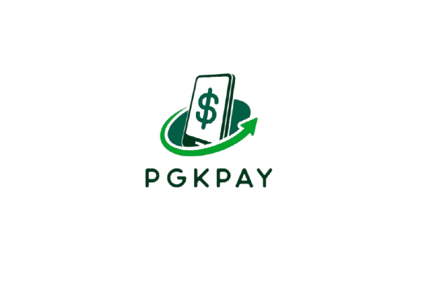

# PGKPay

<hr>

## 📋 Table of contents
 
  
  - [Team](#team)
  - [Our goal](#goal)
  - [Documentation and Presentation](#docs)
  - [Used Technologies](#technologies)
  - [Installation](#instal)

## 👨🏻‍💻 Our Team <a name="team"></a>
 
#### [Martin Shavov](https://github.com/MMShavov22) - Scrum Trainer
####  [Viktor Kanev](https://github.com/VBKanev22)- Backend developer
#### [Velizar Mihailov](https://github.com/VNMihaylov22) - Backend developer
#### [Mihail Nikolov](https://github.com/MANikolov22) - Backend developer

## 💡 Our Goal <a name="goal"></a>

#### Our goal is to make a simplified banking app to help people manage their accounts remotely.

## Documentation <a name="docs"></a>

####  [Documentation](https://codingburgas-my.sharepoint.com/:w:/g/personal/mmshavov22_codingburgas_bg/EdKrHMQEFThApsfPr9YwgtABPYlytQ0tgdp8UuR7AKrB3A?e=C66uP3)
####  [Presentation](https://codingburgas-my.sharepoint.com/:p:/g/personal/mmshavov22_codingburgas_bg/Ea2OeURrTJJKhZEKUVQ5yl4BrS8Tmy_2jXZomTSAx3TCcQ?e=LbwFMM)

## 💻 Used Technologies <a name="technologies"></a>

#### Used code editor & collaborative service: 
 
 


#### Used tools for our documentation, presentation & communication:
 
#### Languages
<p align="left"> 

</p>

## ⚙️ Installation	<a name = "instal"></a>
````
step 0:cmd
step 1: git clone <link>
step 2:close cmd
step 3: open the solution FinanceChallengesProject.sln
step 4: download Raylib
step 5:right-click on FInanceChallengesProject and select properties
step 6:select C/C++ General and Additional Include Directories and find the directory of raylib/include and press the Ok
step 7:select Linker General and Additional Library Directories and find the directory of raylib/lib and press the Ok
step 8:select Linker Input and Additional Dependencies and write raulib.lib and winmm.lib and press the Ok
step 9:select Linker Input and Ignore Specific Default Libraries and write user32.lib and press the Ok
step 10:apply everything and run the program
````
## 👏 Appreciation
```
Thank you for scrolling this far! Please consider giving the repo a star ⭐.
```
