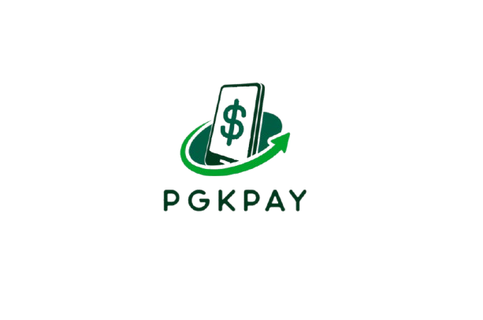

# PGKPay

## Our Team
 
#### [Martin Shavov](https://github.com/MMShavov22) - Scrum Trainer
####  [Viktor Kanev](https://github.com/VBKanev22)- Backend developer
#### [Velizar Mihailov](https://github.com/VNMihaylov22) - Backend developer
#### [Mihail Nikolov](https://github.com/MANikolov22) - Backend developer

## Our Goal

#### Our goal is to make a simplified banking app to help people manage their accounts remotely.

## Documentation

####  [Documentation](https://codingburgas-my.sharepoint.com/:w:/g/personal/mmshavov22_codingburgas_bg/EdKrHMQEFThApsfPr9YwgtABPYlytQ0tgdp8UuR7AKrB3A?e=C66uP3)
####  [Presentation](https://codingburgas-my.sharepoint.com/:p:/g/personal/mmshavov22_codingburgas_bg/Ea2OeURrTJJKhZEKUVQ5yl4BrS8Tmy_2jXZomTSAx3TCcQ?e=LbwFMM)
## Used Technologies

#### Used code editor & collaborative service: 
 
 

#### Used tools for our documentation, presentation & communication:
 
